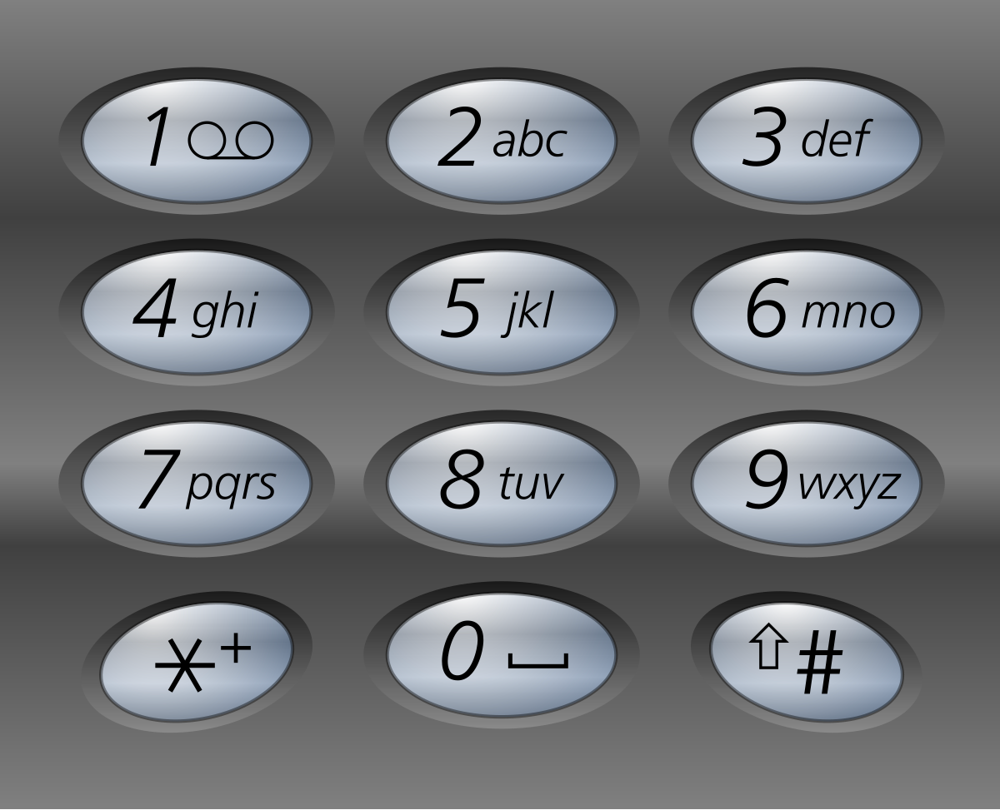

## 题目链接：
- [Leet Code](https://leetcode.com/problems/letter-combinations-of-a-phone-number)

## 题目大意：
- 给定一个仅包含数字 2-9 的字符串，返回所有它能表示的字母组合。给出数字到字母的映射如下(与电话按键相同)。注意 1 不对应任何字母。

## 解题思路：
- 首先可以构造2-9数字对应的字母映射map，既然需要从对应的数字获取相应的字母组合，则需要深度优先遍历(DFS)实现。
- 如果只有一位数字，则只需要获取对应数字map的字符组合即可。
- 如果有多位数字，则将第一位和剩余位数进行组合，剩余位数又可以继续迭代构建，最终降为一位数字。
